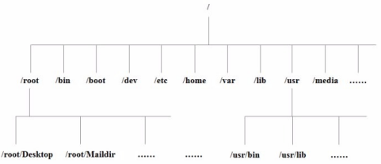
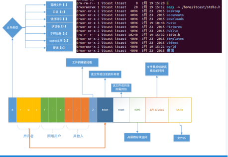

[toc]
# command

## command-line interpreter

### 常用的命令解析器：

1. shell -- Bourne Shell

> /bin/sh

1. bash -- Bourne Again Shell

> /bin/bash

### 当前系统所使用的shell

> echo $SHELL

### 当前系统下有哪些shell

> cat /etc/shells

## shortcut
### Main keyboard shortcuts
#### Cursor position move
- 光标左移： ctrl + b （**←**）
- 坐标右移： ctrl + f （**→**）
- 移动到头部： ctrl + a（**home**）
- 移动到尾部： ctlr + e（**end**）
#### character delete

- 删除光标前边的字符：ctrl + h（Backspace）

- 删除光标后边(光标后边的字符即光标覆盖的字符)的字符：ctrl + d
- 删除光标前所有内容：ctrl + u
- 删除光标后所有内容：ctrl + k
## linux directory organization



### Introduction to the main directories under Linux

- `/bin`: binary，二进制文件，可执行程序，shell命令

  - 如: ls , rm , mv, cp等常用命令

- `/sbin`: s是Super User的意思，这里存放的是系统管理员使用的系统管理程序。
  - 如ifconfig, halt, shutdown, reboot等系统命令
- `/dev`: device，在linux下一切皆文件
  - 硬盘, 显卡, 显示器
  - 字符设备文件、块设备文件
    - 如: 在input目录下执行: sudo cat mouse0, 移动鼠标会显示有输入.

- `/lib`: linux运行的时候需要加载的一些动态库

  - 如: libc.so、libpthread.so等

- `/mnt`: 手动的挂载目录, 如U盘等
- `/media`: 外设的自动挂载目录, 如光驱等。
- `/root`: linux的超级用户root的家目录
- `/usr`: unix system resource--类似于WINDOWS的programe files目录
  - include目录里存放头文件, 如: stdio.h、stdlib.h、string.h、pthread.h
  - games目录下的小游戏-如: sl小火车游戏
- `/etc`: 存放配置文件
  - /etc/passwd
    - man 5 passwd可以查看passwd文件的格式信息
  - /etc/group

    - man 5 group可以查看group文件的格式信息
    
  - /etc/profile
  
      - 系统的配置文件, 修改该文件会影响这个系统下面的所有的用户
- `/opt`: 安装第三方应用程序

    - 比如安装oracle数据库可以在这个目录下

- `/home`: linux操作系统所有用户的家目录
  - 用户家目录：(宿主目录或者主目录）
    - /home/itcast
- `/tmp`: 存放临时文件
  - 新建在这个目录下的文件会在系统重启后自动清除

## file and directory command
### ls

- `ls -l`


  - file type

    `-` ： 普通文件

    `d` ： 目录

    `l` ：  符号链接，相当于windows中的快捷方式

    `s` ： 套接字

    `p` ： 管道

    `b` ： 块设备

    `c` ： 字符设备
### head

- 从文件头部开始查看前n行的内容

- 使用方式：`head -n[行数] 文件名`

	- `head -20 hello.txt`
- 如果没有指定行数，默认显示前10行内容

### ln
- softlink

	- 如何创建软连接
        ```bash
        # file
        ln -s file file.soft
        # directory
        ln -s tmp tmp.link
        ```

	- 创建软链接应注意事项
	
		- ln创建软连接要用绝对路径，因为如果不使用绝对路径，一旦这个连接文件发生位置变动，就不能找到那个文件了。
	
		- 软连接文件的大小是: 路径+文件名的总字节数

- hardlink

    - `ln test.log test.log.hard`
    - 使用硬链接应注意事项
      - 硬链接不能建在目录上
      - 硬连接对绝对路径没有要求
      - 硬连接不能跨文件系统
        - 硬链接文件和源文件的inode是相同的，文件系统的inode要求唯一，跨文件系统可能会使inode不同, 所以硬链接不能跨文件系统

    - 硬链接的本质


      - ls -i 文件名 ------可以查看文件的i节点
      - stat 文件名 ---可以查看i节点信息
      - 当新创建了一个文件, 硬链接计数为1
      - 给文件创建了一个硬链接后, 硬链接计数加1
      - 删除一个硬链接后, 硬链接计数减1
      - 如果删除硬链接后, 硬链接计数为0, 则该文件会删除

  - 硬链接应用场合

    - 可以起到同步文件的作用

    修改file的内容, 会在其余三个硬链接文件上同步.

    - 可以起到保护文件的作用

    删除文件的时候, 只要硬链接计数不为0, 不会真正删除, 起到保护文件的作用.
### wc
- 显示文件行数, 字节数, 单词数
    - `wc -l file`显示文件的总行数
    - `wc -c file`显示文件的总字节数
    - `wc -w file`显示文件的总单词数
    - `wc file` 显示文件的总行数, 单词数和总字节数 
### chmod

- commond：`chmod [who] [+|-|=] [mode] file`

    - u 操作对象【who】

        `u` -- 用户（user）

        `g` -- 同组用户（group）

        `o` -- 其他用户（other）

        `a` -- 所用用户（all）【默认】

    - 操作符【+-=】

      `+` -- 添加权限

      `-` -- 取消权限

      `=` -- 赋予给定权限并取消其他权限
### chown
- 修改文件所有者chown

  `sudo chown mytest file.txt`
- 修改文件所有者和所属组chown

  `sudo chown mytest:mytest file.txt`
### chgrp
- usage `chgrp 用户组 文件或目录名`

  `sudo chgrp mytest file.txt`
### find
- type
- size
  `find ~/ -size +50k -size -100k`
- ctime
  - 创建日期`-ctime -n/+ n`
    - `-n`: n天以内
  - 修改日期`-mtime -n/+n`
  - 访问日期`-atime -n/+n`
- -maxdepth n(层数)
### grep

- grep -r（有目录） &quot;查找的内容&quot; 搜索的路径
  - `-r`参数, 若是目录, 则可以递归搜索
  - `-n`参数可以显示该查找内容所在的行号
  - `-i`参数可以忽略大小写进行查找
  - `-v`参数不显示含有某字符串

- 搜索当前目录下包含hello world字符串的文件
  - grep -r -n &quot;hello world&quot; ./ ------显示行号
  - grep -r -i -n &quot;HELLO world&quot; ./ -------忽略大小小查找
# vim

# gcc

## 静态库（static library）

### 制作静态库(linux)
下面以fun1.c , fun2.c和head.h三个文件为例讲述静态库的制作和使用, 其中head.h文件中有函数的声明,  fun1.c和fun2.c中有函数的实现.
```shell
gcc -c fun1.c fun2.c
ar rcs libtest1.a fun1.o fun2.o
gcc  main.c -L./ -l test1 -I./  -o main1
```
### 静态库的创建(windows)

1. 创建一个新项目，在已安装的模板中选择“常规”，在右边的类型下选择“空项目”，在名称和解决方案名称中输入staticlib。点击确定。

2. 在解决方案资源管理器的头文件中添加,mylib.h文件，在源文件添加mylib.c文件（即实现文件）。

3. 在mylib.h文件中添加如下代码：
```C++
#ifndef TEST_H
#define TEST_H int myadd**(**int a**,**int b**);**
#endif
```
4. 在mylib.c文件中添加如下代码：
```C
#include"test.h"
int myadd(int a,int b)
{return a + b;} 
```
5. 配置项目属性。因为这是一个静态链接库，所以应在项目属性的“配置属性”下选择“常规”，在其下的配置类型中选择“静态库（.lib）。

6. 编译生成新的解决方案，在Debug文件夹下会得到mylib.lib (对象文件库），将该.lib文件和相应头文件给用户，用户就可以使用该库里的函数了。


### 静态库的使用(windows)

- 方法一：配置项目属性

1. 添加工程的头文件目录：工程---属性---配置属性---c/c++---常规---附加包含目录：加上头文件存放目录。
2. 添加文件引用的lib静态库路径：工程---属性---配置属性---链接器---常规---附加库目录：加上lib文件存放目录。
3.  然后添加工程引用的lib文件名：工程---属性---配置属性---链接器---输入---附加依赖项：加上lib文件名。

- 方法二：使用编译语句
```C
#pragma comment(lib,"./mylib.lib")
```
- 方法三：添加工程中

就像你添加.h和.c文件一样,把lib文件添加到工程文件列表中去.切换到"解决方案视图",--->选中要添加lib的工程-->点击右键-->"添加"-->"现有项"-->选择lib文件-->确定.


### 优点
1. 函数库最终被打包到应用程序中，实现是函数本地化，寻址方便、速度快。
（库函数调用效率==自定义函数使用效率）
2. 程序在运行时与函数库再无瓜葛，移植方便。

### 缺点

1. 消耗系统资源较大, 每个进程使用静态库都要复制一份, 无端浪费内存。
2. 静态库会给程序的更新、部署和发布带来麻烦。如果静态库libxxx.a更新了，所有使用它的应用程序都需要重新编译、发布给用户（对于玩家来说，可能是一个很小的改动，却导致整个程序重新下载）。

- 静态库对函数库的链接是放在编译时期完成的，静态库在程序的链接阶段被复制到了程序中，和程序运行的时候没有关系；
- 程序在运行时与函数库再无瓜葛，移植方便。
- 浪费空间和资源，所有相关的目标文件与牵涉到的函数库被链接合成一个可执行文件。


- 程序开发和发布:空间浪费是静态链接的一个问题，另一个问题是静态链接对程序的更新、部署和发布也会带来很多麻烦。比如程序中所使用的mylib.lib是由一个第三方厂商提供的，当该厂商更新容量mylib.lib的时候，那么我们的程序就要拿到最新版的mylib.lib，然后将其重新编译链接后，将新的程序整个发布给用户。这样的做缺点很明显，即一旦程序中有任何模块更新，整个程序就要重新编译链接、发布给用户，用户要重新安装整个程序。


## 动态库
要解决空间浪费和更新困难这两个问题，最简单的办法就是把程序的模块相互分割开来，形成独立的文件，而不是将他们静态的链接在一起。简单地讲，就是不对哪些组成程序的目标程序进行链接，等程序运行的时候才进行链接。也就是说，把整个链接过程推迟到了运行时再进行，这就是动态链接的基本思想。

### 制作

```shell
gcc -fpic -c fun1.c fun2.c
gcc -shared fun1.o fun2.o -o libtest2.so
//让系统找到共享库
gcc main.c  -L./  -l test2  -I./ -o main2
```

### 如何让系统找到共享库

- 拷贝自己制作的共享库到/lib或者/usr/lib
- 临时设置LD_LIBRARY_PATH:
```bash
export LD_LIBRARY_PATH=$LD_LIBRARY_PATH:库路径
```
- 永久设置, 把export LD_LIBRARY_PATH=$LD_LIBRARY_PATH:库路径, 设置到∼/.bashrc文件中, 然后在执行下列三种办法之一:
	- 执行. ~/.bashrc使配置文件生效(第一个.后面有一个空格)
	- 执行source ~/.bashrc配置文件生效
	- 退出当前终端, 然后再次登陆也可以使配置文件生效
- 永久设置,把export LD_LIBRARY_PATH=$LD_LIBRARY_PATH:库路径，设置到/etc/profile文件中
- 将其添加到 /etc/ld.so.cache文件中
	- 编辑/etc/ld.so.conf文件, 加入库文件所在目录的路径
	- 运行sudo ldconfig -v, 该命令会重建/etc/ld.so.cache文件

###  动态库的创建(windows)

1. 创建一个新项目，在已安装的模板中选择“常规”，在右边的类型下选择“空项目”，在名称和解决方案名称中输入mydll。点击确定。

2. 在解决方案资源管理器的头文件中添加,mydll.h文件，在源文件添加mydll.c文件（即实现文件）。

3. 在test.h文件中添加如下代码：

#ifndef TEST_H#define TEST_H __declspec**(**dllexport**)** int myminus**(**int a**,** int b**);** #endif

5.在test.c文件中添加如下代码：

#include"test.h"__declspec**(**dllexport**)** int myminus**(**int a**,** int b**){**	**return** a **-** b**;****}**

5. 配置项目属性。因为这是一个动态链接库，所以应在项目属性的“配置属性”下选择“常规”，在其下的配置类型中选择“动态库（.dll）。

6. 编译生成新的解决方案，在Debug文件夹下会得到mydll.dll (对象文件库），将该.dll文件、.lib文件和相应头文件给用户，用户就可以使用该库里的函数了。

	- 疑问一：__declspec(dllexport)是什么意思？动态链接库中定义有两种函数：导出函数(export  function)和内部函数(internal  function)。 导出函数可以被其它模块调用，内部函数在定义它们的DLL程序内部使用。 
	- 疑问二：动态库的lib文件和静态库的lib文件的区别？在使用动态库的时候，往往提供两个文件：一个引入库（.lib）文件（也称“导入库文件”）和一个DLL（.dll）文件。虽然引入库的后缀名也是“lib”，但是，动态库的引入库文件和静态库文件有着本质的区别，对一个DLL文件来说，其引入库文件（.lib）包含该DLL导出的函数和变量的符号名，而.dll文件包含该DLL实际的函数和数据。在使用动态库的情况下，在编译链接可执行文件时，只需要链接该DLL的引入库文件，该DLL中的函数代码和数据并不复制到可执行文件，直到可执行程序运行时，才去加载所需的DLL，将该DLL映射到进程的地址空间中，然后访问DLL中导出的函数。

### 动态库使用(windows)
#### 方法一：隐式调用

创建主程序TestDll，将mydll.h、mydll.dll和mydll.lib复制到源代码目录下。(P.S：头文件Func.h并不是必需的，只是C++中使用外部函数时，需要先进行声明)在程序中指定链接引用链接库 : #pragma comment(lib,"./mydll.lib")

#### 方法二：显式调用*

HANDLE hDll**;** //声明一个dll实例文件句柄 hDll = LoadLibrary**("mydll.dll");** //导入动态链接库 MYFUNC minus_test**;** //创建函数指针 //获取导入函数的函数指针 minus_test = (MYFUNC)GetProcAddress(hDll, "myminus");
### 特点
- 动态库把对一些库函数的链接载入推迟到程序运行的时期。
- 可以实现进程之间的资源共享。（因此动态库也称为共享库）
- 将一些程序升级变得简单。
- 甚至可以真正做到链接载入完全由程序员在程序代码中控制（显示调用）

## 比较
 静态库的优点:
 	1 执行速度快, 是因为静态库已经编译到可执行文件内部了
 	2 移植方便, 不依赖域其他的库文件
 缺点: 
 	1 耗费内存, 是由于每一个静态库的可执行程序都会加载一次
 	2 部署更新麻烦, 因为静态库修改以后所有的调用到这个静态库的可执行文
件都需要重新编译

 动态库的优点:
 	1 节省内存
 	2 部署升级更新方便, 只需替换动态库即可, 然后再重启服务.
 缺点: 
 	1 加载速度比静态库慢
 	2 移植性差, 需要把所有用到的动态库都移植.

由于由静态库生成的可执行文件是把静态库加载到了其内部, 所以静态库生成的可执行文件一般会比动态库大.
- QT gcc path
 `D:\Programs\QT\Tools\mingw810_64\bin`

| 选项         | 含义                                                         |
| ------------ | ------------------------------------------------------------ |
| \-o file     | 指定生成的输出文件名为file                                   |
| \-E          | 只进行预处理 ,生成`.i`                                       |
| \-S\(大写\)  | 只进行预处理和编译,生成`.s`                                  |
| \-c\(小写\)  | 只进行预处理、编译和汇编,生成`.o`                            |
| -l   library | Search the library named library when linking                |
| -L dir       | Add directory dir to the list of directories to be searched for -l |
| -I           | specify directories to search for header files               |


| ***\*文件后缀\**** | ***\*含义\****        |
| ------------------ | --------------------- |
| .c                 | C 语言文件            |
| .i                 | 预处理后的 C 语言文件 |
| .s                 | 编译后的汇编文件      |
| .o                 | 编译后的目标文件      |


# makefile 

# gdb

# file

# process

# interprocess communication

# signal

# deamon

# thread

# thread synchronization 

